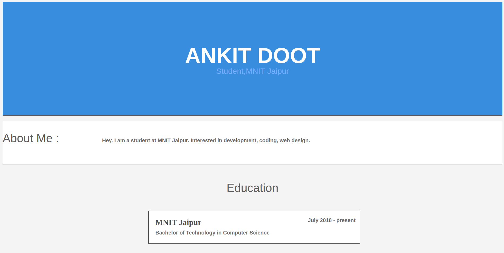
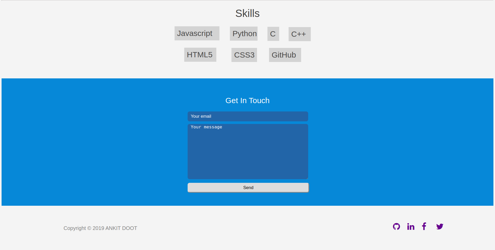

# [My Portfolio](https://ankitdoot.github.io/myportfolio/)

### Motivation :

Primarily motivation is to build a portfolio to showcase my skills as a frontend web developer and as a computer science and engineering student.

### Tech used :

_HTML5,CSS3_

### Screenshots :

## Contribute :

You can contribute to this website by making it Moblie-Friendly.
## Credits :

I took inspiration from portfolio of [Rishabh Kalakoti](https://rishabhkalakoti.github.io/)

